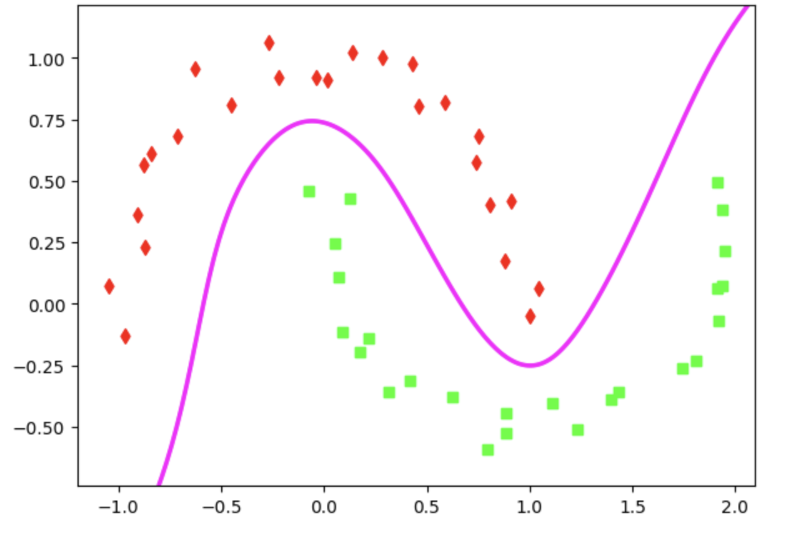
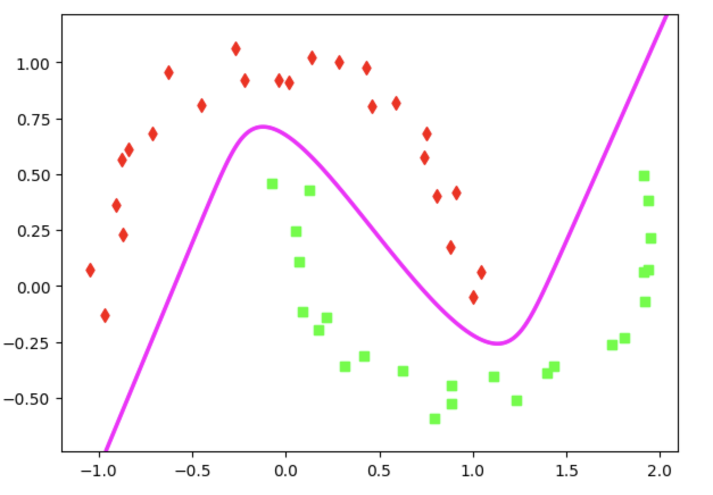

# CV2026
### Homework1
[yolo test video](https://youtu.be/b-2xvB9VPXQ)
 
[selfie test video](https://youtu.be/Zf_-dgLY3Vo)

### Homework2

### 입력층 2개, 첫 번째 은닉층 2개, 두 번째 은닉층 2개, 출력층 1개

<a href="homework/SLOC01_HW1_2-2-1.ipynb">Classification_homework 코드</a>

### 입력층 2개, 첫 번째 은닉층 5개, 두 번째 은닉층 5개, 출력층 1개

<a href="homework/SLOC01_HW1_5-5-1.ipynb">Classification_homework 코드</a>

### 입력층 2개, 첫 번째 은닉층 10개, 두 번째 은닉층 10개, 출력층 1개

<a href="homework/SLOC01_HW1_10-10-1.ipynb">Classification_homework 코드</a>
